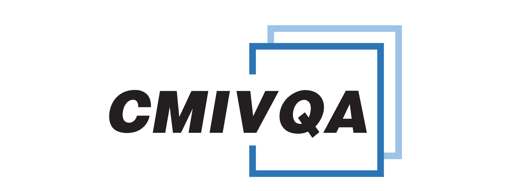
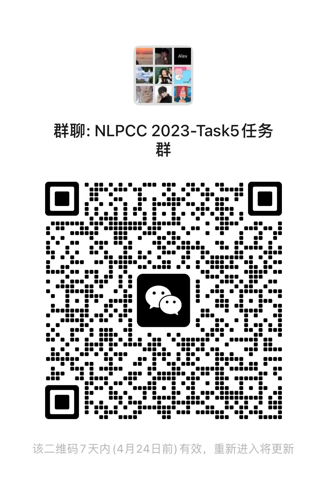

# CMIVQA Baseline 🌟
<p align="center">
    
    
    
    
</p>

<p align="center">
  
</p>
欢迎来到我们的CMIVQA比赛基线代码仓库！在这里，你将找到用于解决Track 1，Track 2 和Track 3任务的基线代码。下面是仓库的内容概述和如何使用基线代码进行训练和测试的说明。
每个子项目都包含两个主要部分：环境安装和快速开始。请确保按照下面的说明正确配置环境，并使用我们提供的示例代码进行训练和测试。祝你好运！😃

### CMIVQA Track 1 Baseline
这个任务是关于单视频中视频问答定位（TAGSV），目标是从给定的单个医疗教学视频中使用自然语言问题定位视觉答案。为了解决这个问题，我们提出了一种新的跨模态相互知识转移跨度定位（MutualSL）来解决跨模态知识偏差。

详细的方法描述和实现可以在子目录的README.md文件中找到。[点击此处查看子目录的README.md](https://github.com/WENGSYX/CMIVQA_Baseline/tree/main/task1)


### CMIVQA Track 2/3 Baseline
这个任务是关于视频视觉答案定位（VCVAL），目标是在大量未修剪，未分段的教学视频中使用自然语言问题定位视觉答案。我们将此任务拆解分为2个子任务：视频数据库检索（Video Corpus Retrieval, VCR）和视频数据库中时序问答定位（Temporal Answer Grounding in Video Corpus, TAGVC）。为了解决这个问题，我们提出了一种跨模态对比全局跨度（CCGS）方法，联合训练视频语料库检索和视觉答案定位任务。

详细的方法描述和实现可以在子目录的README.md文件中找到。[点击此处查看子目录的README.md](https://github.com/WENGSYX/CMIVQA_Baseline/tree/main/task23)
[Issues](https://github.com/WENGSYX/CMIVQA_Baseline/issues)
### 如果在环境部署或者代码运行上出现问题，欢迎提[Issues](https://github.com/WENGSYX/CMIVQA_Baseline/issues),或者联系[Yixuan Weng](mailto:wengsyx@gmail.com)或[Bin Li](mailto:libincn@hnu.edu.cn)

### 特别提醒！
###### 2023/4/17 我们在百度云盘中更正了LILVsv4Ft_E和D_igZblZVp0两则视频，对于已下载的团队，可重新下载这两则视频及其npy文件。


### 如果您在研究中使用了我们的代码，请引用以下论文：
```
@article{weng2022visual,
  title={Visual Answer Localization with Cross-modal Mutual Knowledge Transfer},
  author={Weng, Yixuan and Li, Bin},
  journal={arXiv preprint arXiv:2210.14823},
  year={2022}
}

@article{li2022learning,
  title={Learning to Locate Visual Answer in Video Corpus Using Question},
  author={Li, Bin and Weng, Yixuan and Sun, Bin and Li, Shutao},
  journal={arXiv preprint arXiv:2210.05423},
  year={2022}
}
```

### 官方微信群
<p align="center">
  
</p>

### 祝你在CMIVQA比赛中取得好成绩！🏆🎉
