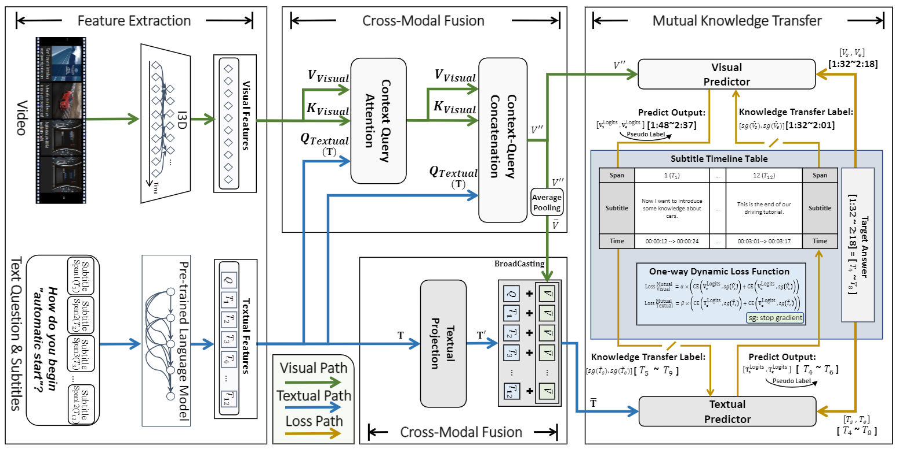

# CMIVQA Track 1 Baseline


## Updates

- 2023/4/10 updates codes 🏆

## Main Method



###### 这个任务是关于视频语料库视觉答案定位（VCVAL），目标是从给定的单个医疗教学视频中使用自然语言问题定位视觉答案。为了解决这个问题，我们提出了一种新的跨模态相互知识转移跨度定位（MutualSL）来解决跨模态知识偏差。


## 环境安装

- python 3.7 with pytorch (`1.10.0`), transformers(`4.15.0`), tqdm, accelerate, pandas, numpy, glob, sentencepiece
- cuda10/cuda11

#### Installing the GPU driver

```shell script
# preparing environment
sudo apt-get install gcc
sudo apt-get install make
wget https://developer.download.nvidia.com/compute/cuda/11.5.1/local_installers/cuda_11.5.1_495.29.05_linux.run
sudo sh cuda_11.5.1_495.29.05_linux.run
```

#### Installing Conda and Python

```shell script
# preparing environment
wget -c https://repo.continuum.io/miniconda/Miniconda3-latest-Linux-x86_64.sh
sudo chmod 777 Miniconda3-latest-Linux-x86_64.sh 
bash Miniconda3-latest-Linux-x86_64.sh

conda create -n CCGS python==3.7
conda activate CCGS
```

#### Installing Python Libraries

```plain
# preparing environment
pip install torch==1.10.0+cu113 torchvision==0.11.1+cu113 torchaudio==0.10.0+cu113 -f https://download.pytorch.org/whl/cu113/torch_stable.html
pip install tqdm transformers sklearn pandas numpy glob accelerate sentencepiece
```

## 数据

请从[百度网盘](https://pan.baidu.com/s/1eN_mo3iHyyHVH_8dciElqA?pwd=9871)或者[GoogleDrive](https://drive.google.com/drive/folders/1QbY8DEaVLkY2w6vOCWAs4ZQFHgJ3q8ui?usp=sharing)中下载数据，并以以下格式放置于本地文件的NLPCC_2023_CMIVQA_TRAIN_DEV中：

另外subtitle.json是本baseline单独处理完成的文件，请从[百度网盘](https://pan.baidu.com/s/1_4nUimt8oHhAX1Deaxp0_g?pwd=2024)下载

**TestB Subtitle已更新**([百度网盘]https://pan.baidu.com/s/1_DEyzSFZ48XF2js2eW3y0A?pwd=ubhk )下载
```plain
-- NLPCC_2023_CMIVQA_TRAIN_DEV
  -- CMIVQA_Train_Dev.json
  -- video_feature
  -- subtitle.json
```

运行本项目，需要NLPCC_2023_CMIVQA_TRAIN_DEV中的`CMIVQA_Train_Dev.json`文件、`video_feature`文件夹和`subtitle.json`文件


### 测试数据

```plain
-- NLPCC_2023_CMIVQA_TESTA
  -- dataset_testA_for_track23.json
  -- video_feature
  -- subtitle.json
```

运行本项目，需要NLPCC_2023_CMIVQA_TESTA中的`CMIVQA_Train_Dev.json`文件、`video_feature`文件夹和`subtitle.json`文件


## 快速开始

### 训练

```shell script
python main.py
```

> 你可以调整其中的超参数以确保正常运行

### 测试

```shell script
python test.py
```

> 你需要从log中加载训练完成的模型，以生成最终结果


## 性能

#### Temporal Answer Grounding in Singe Video Track

| R@1, IoU=0.3 | R@1, IoU=0.5 | R@1, IoU=0.7 | mIoU(R@1) |
| ------------ | ------------ | ------------ | --------- |
| 0.5671        | 0.4065        | 0.2358       | 0.3997     |


## Cite
```
author={Weng, Yixuan and Li, Bin},
  booktitle={ICASSP 2023 - 2023 IEEE International Conference on Acoustics, Speech and Signal Processing (ICASSP)}, 
  title={Visual Answer Localization with Cross-Modal Mutual Knowledge Transfer}, 
  year={2023},
  volume={},
  number={},
  pages={1-5},
  doi={10.1109/ICASSP49357.2023.10095026}}
```
