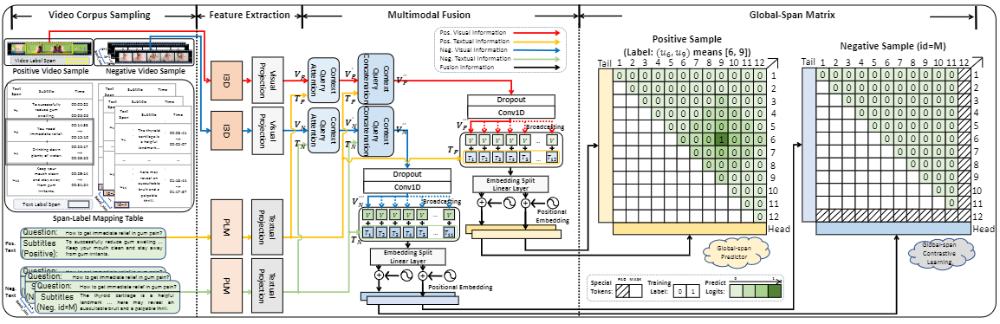

# CMIVQA Track 2/3 Baseline


- 2023/4/10 updates codes 🏆

## 方法



###### we propose a novel cross-modal mutual knowledge transfer span localization (MutualSL) method to reduce the cross-modal knowledge deviation shown in Fig.~\ref{sample2}(d). Specifically, the MutualSL uses both visual predictor and textual predictor, where these two predictors have different prediction targets so that they have different strength perceptions of different-modal information. We expect that these two predictors can enhance the information perception of their own modal. Each predictor needs to predict the output value of another predictor on the basis of the target answer in the training stage. Then we design a one-way dynamic loss function (ODL) to dynamically adjust the knowledge transfer, which can alleviate the difference of cross-modal knowledge transferring in the training process.

## 环境安装

- python 3.7 with pytorch (`1.10.0`), transformers(`4.15.0`), tqdm, accelerate, pandas, numpy, sentencepiece
- cuda10/cuda11

#### Installing the GPU driver

```shell script
# preparing environment
sudo apt-get install gcc
sudo apt-get install make
wget https://developer.download.nvidia.com/compute/cuda/11.5.1/local_installers/cuda_11.5.1_495.29.05_linux.run
sudo sh cuda_11.5.1_495.29.05_linux.run
```

#### Installing Conda and Python

```shell script
# preparing environment
wget -c https://repo.continuum.io/miniconda/Miniconda3-latest-Linux-x86_64.sh
sudo chmod 777 Miniconda3-latest-Linux-x86_64.sh 
bash Miniconda3-latest-Linux-x86_64.sh

conda create -n mutualsl python==3.7
conda activate mutualsl
```

#### Installing Python Libraries

```plain
# preparing environment
pip install torch==1.10.0+cu113 torchvision==0.11.1+cu113 torchaudio==0.10.0+cu113 -f https://download.pytorch.org/whl/cu113/torch_stable.html
pip install tqdm transformers sklearn pandas numpy accelerate sentencepiece pkuseg
```

## 数据

请从[百度网盘](https://pan.baidu.com/s/1VRJZaQyGn5PbyGt0yVo1Gg?pwd=9874)或者[GoogleDrive](https://drive.google.com/drive/folders/1QbY8DEaVLkY2w6vOCWAs4ZQFHgJ3q8ui?usp=sharing)中下载数据，并以以下格式放置于本地文件的NLPCC_2023_CMIVQA_TRAIN_DEV中：

其中的subtitle.json是处理完成的文件，请从[百度网盘](https://pan.baidu.com/s/1ZpicCahLs-DwKQHJW7gz-A?pwd=1234)下载

```plain
-- NLPCC_2023_CMIVQA_TRAIN_DEV
  -- CMIVQA_Train_Dev.json
  -- video_feature
  -- subtitle.json
```

运行本项目，需要NLPCC_2023_CMIVQA_TRAIN_DEV中的`CMIVQA_Train_Dev.json`文件、`video_feature`文件夹和`subtitle.json`文件


### 测试数据

```plain
-- NLPCC_2023_CMIVQA_TESTA
  -- dataset_testA_for_track23.json
  -- video_feature
  -- subtitle.json
```

运行本项目，需要NLPCC_2023_CMIVQA_TESTA中的`CMIVQA_Train_Dev.json`文件、`video_feature`文件夹和`subtitle.json`文件


## 快速开始

### 训练

```shell script
python main.py
```

> 你可以调整其中的超参数以确保正常运行

### 测试

```shell script
python test.py
```

> 你需要从log中加载训练完成的模型，以生成最终结果


## 性能

#### Video Corpus Retrieval Track

| R@1    | R@10   | R@50   | MRR    | Overall |
| ------ | ------ | ------ | ------ | ------- |
| 0.3943 | 0.5366 | 0.6423 | 0.4412 | 2.0144  |

#### Temporal Answer Grounding in Video Corpus Track

| R@1\|mIoU | R@10\|mIoU | R@50\|mIoU | Average |
| --------- | ---------- | ---------- | ------- |
| 0.1947    | 0.3397     | 0.4409     | 0.3251  |


### contributions

- we propose the MutualSL method, which for the first time uses two different predictors in VAL tasks meanwhile, and uses a Look-up Table to achieve cross-modal knowledge transfer; 
- We design ODL to dynamically adjust the knowledge transfer, which can alleviate the differences in knowledge transfer between different predictors
- We have conducted extensive experiments to prove the effectiveness of the MutualSL, where results show that the proposed method outperforms all other competitive SOTA methods in VAL tasks.

## Cite

```
@article{weng2022visual,
  title={Visual Answer Localization with Cross-modal Mutual Knowledge Transfer},
  author={Weng, Yixuan and Li, Bin},
  journal={arXiv preprint arXiv:2210.14823},
  year={2022}
}

```
